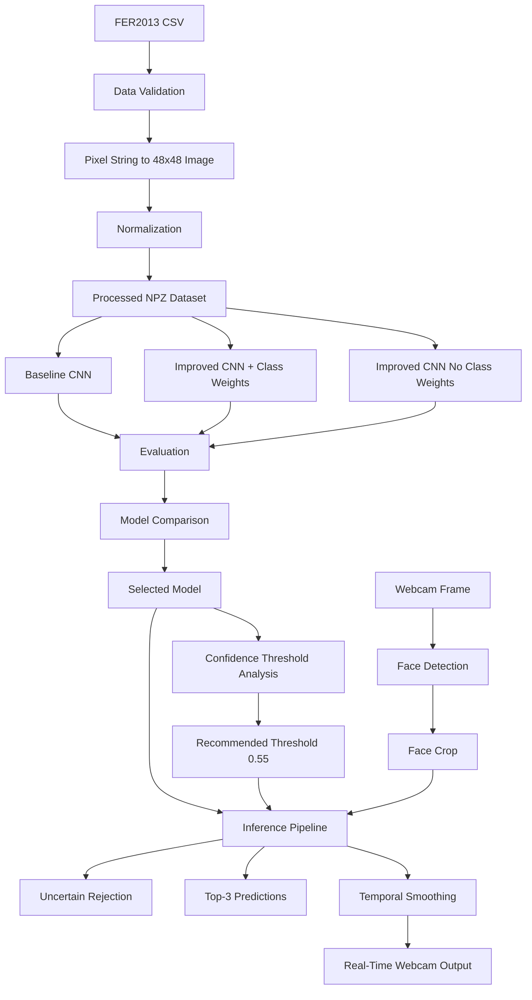

# Facial Emotion Recognition with Confidence-Aware Real-Time Inference

A complete deep learning project for facial emotion recognition using the FER2013 dataset.

This repository is not only a trained CNN model. It is a full machine learning pipeline with data preprocessing, baseline modeling, improved CNN experiments, ablation analysis, confidence thresholding, `Uncertain` rejection, real-time webcam inference, temporal smoothing, notebooks, visual outputs, and automated tests.

---

## Academic Context

This project was developed as a university **Data Mining** course project.

| Field | Information |
|---|---|
| Course | Data Mining |
| Instructor | Dr. Keyvan Borna |
| Students | Sobhan Ebrahimi, Mohsen Mirzaei |
| Project topic | Facial Emotion Recognition |
| Dataset | FER2013 |
| Main objective | Build, evaluate, and document a complete machine learning pipeline for facial emotion recognition |

The project was completed by **Sobhan Ebrahimi** and **Mohsen Mirzaei** under the guidance and assignment direction of **Dr. Keyvan Borna**.

---

## Project Highlights

| Area | Status |
|---|---:|
| FER2013 preprocessing pipeline | Complete |
| Baseline CNN | Complete |
| Improved CNN with class weights | Complete |
| Improved CNN without class weights | Complete |
| Model comparison and ablation | Complete |
| Confidence threshold analysis | Complete |
| `Uncertain` rejection output | Complete |
| Real-time webcam demo | Complete |
| Temporal smoothing | Complete |
| Unit tests | 56 passed |
| Notebooks | 4 completed |

---

## Visual Overview

### Model Performance Comparison


### Confidence Threshold Analysis


### Threshold-Based Test Predictions


---

## Problem Statement

Facial emotion recognition aims to classify a face image into an emotion category. In real-world usage, however, forcing a model to always output an emotion can be misleading when the model is uncertain.

This project solves the task in two layers:

1. **Emotion Classification**  
   Predict one of the seven FER2013 emotion classes.

2. **Confidence-Aware Rejection**  
   If the model confidence is too low, output `Uncertain` instead of forcing a potentially wrong prediction.

---

## Emotion Classes

| Class ID | Emotion |
|---:|---|
| 0 | Angry |
| 1 | Disgust |
| 2 | Fear |
| 3 | Happy |
| 4 | Sad |
| 5 | Surprise |
| 6 | Neutral |

The final inference system also supports:

| Output | Meaning |
|---|---|
| `Uncertain` | Confidence is below the selected threshold |

`Uncertain` is not a trained emotion class. It is a post-processing rejection decision.

---

## System Architecture



---

## Project Structure

```text
facial-emotion-recognition/
├── data/
│   ├── raw/
│   │   └── fer2013.csv
│   └── processed/
│       ├── fer2013_processed.npz
│       ├── class_weights.json
│       └── processed_summary.csv
│
├── models/
│   ├── baseline_cnn_best.keras
│   ├── baseline_cnn_final.keras
│   ├── improved_cnn_best.keras
│   ├── improved_cnn_final.keras
│   ├── improved_cnn_no_class_weights_best.keras
│   └── improved_cnn_no_class_weights_final.keras
│
├── notebooks/
│   ├── 01_data_exploration.ipynb
│   ├── 02_baseline_cnn_results.ipynb
│   ├── 03_improved_cnn_comparison.ipynb
│   └── 04_threshold_analysis.ipynb
│
├── outputs/
│   ├── figures/
│   ├── metrics/
│   └── demo/
│
├── scripts/
│   ├── save_processed_data.py
│   ├── train_baseline.py
│   ├── evaluate_baseline.py
│   ├── plot_baseline_history.py
│   ├── train_improved.py
│   ├── evaluate_improved.py
│   ├── train_improved_no_class_weights.py
│   ├── evaluate_improved_no_class_weights.py
│   ├── compare_model_results.py
│   ├── plot_improved_histories.py
│   ├── threshold_analysis.py
│   ├── demo_test_predictions.py
│   └── webcam_demo.py
│
├── src/
│   ├── config.py
│   ├── preprocessing.py
│   ├── dataset.py
│   ├── processed_loader.py
│   ├── models.py
│   ├── thresholding.py
│   ├── inference.py
│   ├── face_detection.py
│   └── temporal_smoothing.py
│
├── tests/
│   ├── test_preprocessing.py
│   ├── test_processed_loader.py
│   ├── test_models.py
│   ├── test_thresholding.py
│   ├── test_inference.py
│   ├── test_face_detection.py
│   └── test_temporal_smoothing.py
│
├── docs/
│   ├── TECHNICAL_REPORT.md
│   ├── MODEL_CARD.md
│   ├── USER_GUIDE.md
│   └── SUBMISSION_CHECKLIST.md
│
├── requirements.txt
├── README.md
└── .gitignore
```

---

## Dataset

This project uses the FER2013 dataset.

Expected path:

```text
data/raw/fer2013.csv
```

Expected columns:

```text
emotion
pixels
Usage
```

Official FER2013 splits are preserved:

| FER2013 Usage | Project Split | Samples |
|---|---|---:|
| Training | Train | 28,709 |
| PublicTest | Validation | 3,589 |
| PrivateTest | Test | 3,589 |

Total samples:

```text
35,887
```

---

## Preprocessing Pipeline


Preprocessing includes:

- Pixel string parsing
- Shape validation
- Pixel range validation
- Normalization to `[0, 1]`
- Channel dimension expansion
- Optional histogram equalization for webcam/external input

---

## Models

### Baseline CNN

A simple CNN used as the reference model.

Main components:

- Convolutional blocks
- Max pooling
- Dropout
- Dense classifier
- Softmax output

Parameter count:

```text
683,527
```

### Improved CNN

A stronger model using:

- Data augmentation
- Batch normalization
- Deeper convolutional blocks
- Global average pooling
- Dropout

Parameter count:

```text
617,511
```

Although deeper, the improved model has fewer parameters because it uses global average pooling instead of flattening a large feature map.

---

## Experiment Summary

| Experiment | Architecture | Data Augmentation | Batch Norm | Class Weights |
|---|---|---:|---:|---:|
| Baseline CNN | Simple CNN | No | No | No |
| Improved CNN + Class Weights | Improved CNN | Yes | Yes | Yes |
| Improved CNN No Class Weights | Improved CNN | Yes | Yes | No |

---

## Final Model Results

| Model | Test Accuracy | Macro Precision | Macro Recall | Macro F1 | Weighted F1 | Test Loss |
|---|---:|---:|---:|---:|---:|---:|
| Baseline CNN | 0.5882 | 0.5912 | 0.5211 | 0.5304 | 0.5731 | 1.1067 |
| Improved CNN + Class Weights | 0.5252 | 0.4440 | 0.4896 | 0.4439 | 0.4948 | 1.2128 |
| Improved CNN No Class Weights | 0.5977 | 0.4855 | 0.5027 | 0.4870 | 0.5811 | 1.0636 |

### Best Models by Metric

| Metric | Best Model | Score |
|---|---|---:|
| Test Accuracy | Improved CNN No Class Weights | 0.5977 |
| Macro F1 | Baseline CNN | 0.5304 |
| Weighted F1 | Improved CNN No Class Weights | 0.5811 |

---

## Result Interpretation

The improved CNN without class weights achieved the best overall accuracy and weighted F1-score. This makes it the selected model for final inference.

However, the baseline CNN achieved the best macro F1-score, which means it was more balanced across classes.

The class-weighted improved model increased attention to minority classes in some cases, but reduced global performance. This shows that class weighting is not always beneficial and should be validated experimentally.

---

## Confidence Thresholding

The selected threshold is:

```text
0.55
```

Validation results at threshold `0.55`:

| Metric | Value |
|---|---:|
| Raw Accuracy | 0.5940 |
| Accepted Accuracy | 0.8147 |
| Coverage | 0.4316 |
| Rejection Rate | 0.5684 |

Interpretation:

- Before thresholding, validation accuracy is about 59.4%.
- After thresholding, accepted predictions reach about 81.5% accuracy.
- The model rejects about 56.8% of samples as `Uncertain`.

This improves reliability when the model chooses to make a prediction.

---

## Threshold Trade-Off

| Threshold | Coverage | Rejection Rate | Accepted Accuracy |
|---:|---:|---:|---:|
| 0.40 | 0.6793 | 0.3207 | 0.6944 |
| 0.45 | 0.5751 | 0.4249 | 0.7326 |
| 0.50 | 0.4971 | 0.5029 | 0.7702 |
| 0.55 | 0.4316 | 0.5684 | 0.8147 |
| 0.60 | 0.3784 | 0.6216 | 0.8476 |
| 0.65 | 0.3399 | 0.6601 | 0.8713 |
| 0.70 | 0.3031 | 0.6969 | 0.8906 |
| 0.75 | 0.2641 | 0.7359 | 0.9146 |
| 0.80 | 0.2299 | 0.7701 | 0.9333 |
| 0.85 | 0.1953 | 0.8047 | 0.9529 |
| 0.90 | 0.1599 | 0.8401 | 0.9704 |

---

## Real-Time Webcam Demo

Run:

```powershell
python -m scripts.webcam_demo
```

Controls:

| Key | Action |
|---|---|
| `q` | Quit |
| `ESC` | Quit |
| `s` | Save snapshot |

The webcam demo includes:

- OpenCV face detection
- Largest-face selection
- Face crop preprocessing
- Emotion prediction
- Confidence thresholding
- Top-3 prediction display
- Temporal smoothing
- FPS display
- Snapshot saving

---

## Temporal Smoothing

Real-time predictions often jump between emotion labels. To reduce flicker, the project uses a temporal smoothing window.

Default smoothing window:

```text
7 frames
```

The smoother returns the most frequent label in the recent prediction window and averages confidence for that selected label.

---

## Notebooks

| Notebook | Purpose |
|---|---|
| `01_data_exploration.ipynb` | Dataset inspection, class distribution, and sample visualization |
| `02_baseline_cnn_results.ipynb` | Baseline model performance and confusion matrix |
| `03_improved_cnn_comparison.ipynb` | Improved model experiments and ablation comparison |
| `04_threshold_analysis.ipynb` | Confidence thresholding and `Uncertain` rejection |

---

## How to Run

### 1. Create Environment

```powershell
python -m venv .venv
.\.venv\Scripts\Activate.ps1
pip install -r requirements.txt
```

### 2. Save Processed Data

```powershell
python -m scripts.save_processed_data
```

### 3. Train Models

```powershell
python -m scripts.train_baseline --epochs 25 --batch-size 64
python -m scripts.train_improved --epochs 25 --batch-size 64
python -m scripts.train_improved_no_class_weights --epochs 25 --batch-size 64
```

### 4. Evaluate Models

```powershell
python -m scripts.evaluate_baseline
python -m scripts.evaluate_improved
python -m scripts.evaluate_improved_no_class_weights
```

### 5. Compare Models

```powershell
python -m scripts.compare_model_results
```

### 6. Run Threshold Analysis

```powershell
python -m scripts.threshold_analysis
```

### 7. Generate Demo Predictions

```powershell
python -m scripts.demo_test_predictions
```

### 8. Run Webcam Demo

```powershell
python -m scripts.webcam_demo
```

---

## Testing

Run:

```powershell
python -m pytest
```

Current result:

```text
56 passed
```

Tested modules:

| Module | Purpose |
|---|---|
| `preprocessing.py` | Image preprocessing validation |
| `processed_loader.py` | Processed dataset loading |
| `models.py` | CNN architecture validation |
| `thresholding.py` | Confidence threshold logic |
| `inference.py` | Prediction pipeline |
| `face_detection.py` | Face detection utilities |
| `temporal_smoothing.py` | Webcam smoothing logic |

---

## Limitations

1. FER2013 images are low-resolution grayscale images.
2. The `Disgust` class is highly underrepresented.
3. Emotion labels can be visually ambiguous.
4. Webcam lighting and face angle affect prediction quality.
5. Haar Cascade is simple and can fail in difficult scenes.
6. Thresholding improves reliability but rejects many predictions.
7. The model was trained from scratch instead of using transfer learning.

---

## Future Work

1. Use transfer learning with a stronger pretrained CNN.
2. Replace Haar Cascade with MediaPipe, RetinaFace, or YuNet.
3. Add face alignment before classification.
4. Use focal loss for class imbalance.
5. Add calibration analysis for confidence scores.
6. Track multiple faces with separate smoothing windows.
7. Export the model for deployment.
8. Build a web or desktop interface.

---

## Final Selection

Selected model:

```text
Improved CNN without Class Weights
```

Selected threshold:

```text
0.55
```

Main reason:

- Best test accuracy
- Best weighted F1-score
- Lowest test loss
- Stronger architecture
- Confidence-aware inference support

---

## Conclusion

This project implements a complete facial emotion recognition pipeline with a reliability layer.

The final system does not blindly force predictions. It can output `Uncertain` when confidence is too low, making the project more realistic and safer for real-time demonstration.
