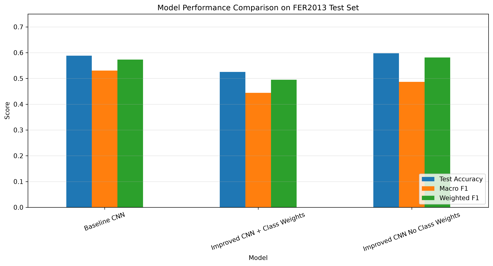
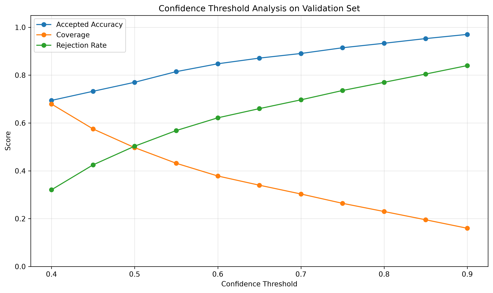
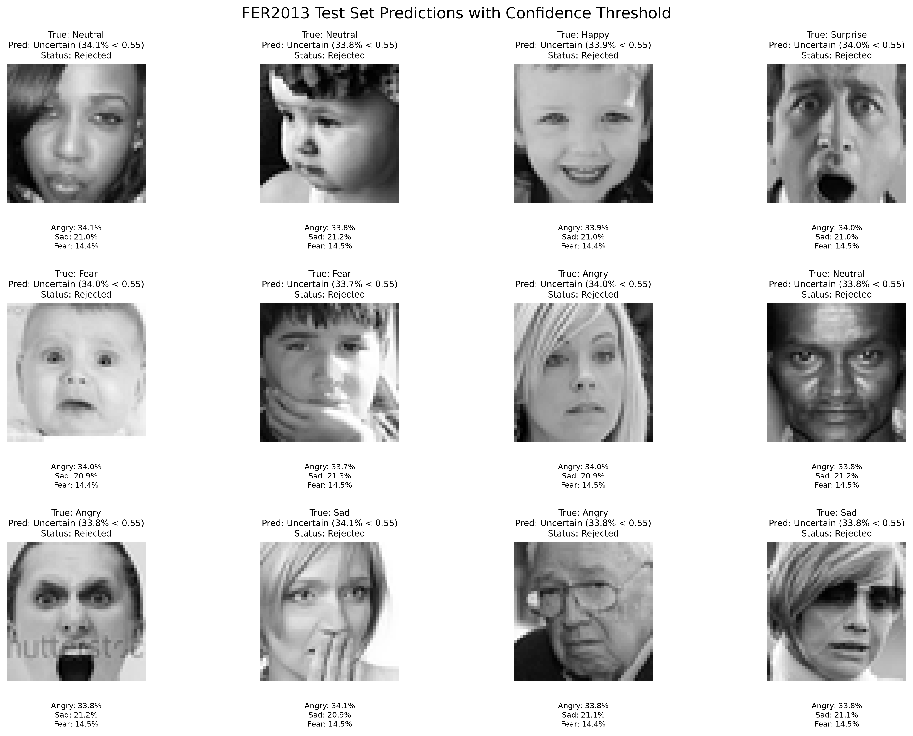

# Experiment Log

This document summarizes the main experiments performed in the project.

---

## Experiment 1: Baseline CNN

### Goal

Create a simple CNN reference model for FER2013.

### Result

| Metric | Value |
|---|---:|
| Test Accuracy | 0.5882 |
| Macro Precision | 0.5912 |
| Macro Recall | 0.5211 |
| Macro F1 | 0.5304 |
| Weighted F1 | 0.5731 |
| Test Loss | 1.1067 |

### Notes

The baseline performed reasonably well and achieved the best macro F1-score among the tested models.

---

## Experiment 2: Improved CNN with Class Weights

### Goal

Test whether a deeper architecture with data augmentation, batch normalization, and class weights improves performance.

### Result

| Metric | Value |
|---|---:|
| Test Accuracy | 0.5252 |
| Macro Precision | 0.4440 |
| Macro Recall | 0.4896 |
| Macro F1 | 0.4439 |
| Weighted F1 | 0.4948 |
| Test Loss | 1.2128 |

### Notes

Class weighting helped some minority-class behavior but reduced global performance.

---

## Experiment 3: Improved CNN without Class Weights

### Goal

Test whether the improved architecture performs better without class-weight correction.

### Result

| Metric | Value |
|---|---:|
| Test Accuracy | 0.5977 |
| Macro Precision | 0.4855 |
| Macro Recall | 0.5027 |
| Macro F1 | 0.4870 |
| Weighted F1 | 0.5811 |
| Test Loss | 1.0636 |

### Notes

This model achieved the best test accuracy, weighted F1-score, and test loss.

---

## Experiment 4: Model Comparison

### Goal

Compare all trained models under the same test-set evaluation.

### Figure



### Conclusion

The improved CNN without class weights was selected for inference because it achieved the best global performance.

---

## Experiment 5: Confidence Threshold Analysis

### Goal

Reduce unreliable predictions by outputting `Uncertain` when confidence is low.

### Figure



### Selected Threshold

```text
0.55
```

### Result

| Metric | Value |
|---|---:|
| Raw Accuracy | 0.5940 |
| Accepted Accuracy | 0.8147 |
| Coverage | 0.4316 |
| Rejection Rate | 0.5684 |

### Conclusion

Thresholding significantly improves accepted prediction reliability.

---

## Experiment 6: Test Prediction Demo

### Goal

Create visual examples of model predictions with thresholding.

### Figure



### Conclusion

The demo makes the threshold behavior interpretable and useful for reports/presentations.

---

## Experiment 7: Webcam Demo

### Goal

Create a real-time facial emotion recognition demo.

### Components

| Component | Implementation |
|---|---|
| Face detection | OpenCV Haar Cascade |
| Face selection | Largest face |
| Classification | Improved CNN without class weights |
| Reliability | Confidence threshold |
| Stability | Temporal smoothing |
| Display | OpenCV window |

### Conclusion

The webcam demo runs successfully and provides real-time emotion predictions with confidence-aware rejection.
