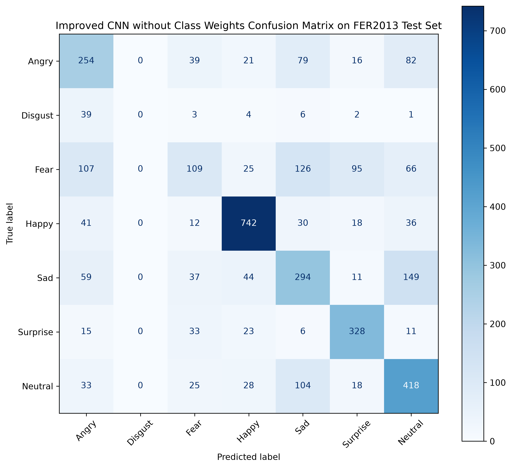

# Model Card: Facial Emotion Recognition CNN

## Model Details

| Field | Description |
|---|---|
| Model name | Improved CNN without Class Weights |
| Task | Facial emotion recognition |
| Dataset | FER2013 |
| Input shape | 48×48×1 |
| Output classes | 7 FER2013 emotion classes |
| Final inference output | Emotion label or `Uncertain` |
| Framework | TensorFlow / Keras |
| Selected model file | `models/improved_cnn_no_class_weights_best.keras` |
| Confidence threshold | 0.55 |

---

## Intended Use

This model is intended for educational and demonstrational facial emotion recognition.

Recommended uses:

- University machine learning project
- Computer vision demonstration
- FER2013 benchmarking
- Real-time webcam demo
- Confidence-aware inference example

Not recommended for:

- Medical diagnosis
- Psychological assessment
- Hiring or surveillance decisions
- High-stakes emotion interpretation
- Real-world production use without stronger validation

---

## Input

The model expects a grayscale face image:

```text
Shape: 48 x 48 x 1
Range: 0 to 1
```

For webcam inference, the system:

1. Detects a face.
2. Crops the face region.
3. Converts it to grayscale.
4. Resizes it to 48×48.
5. Normalizes pixels.
6. Feeds it into the CNN.

---

## Output

The model produces a probability distribution over seven emotions:

| Class ID | Emotion |
|---:|---|
| 0 | Angry |
| 1 | Disgust |
| 2 | Fear |
| 3 | Happy |
| 4 | Sad |
| 5 | Surprise |
| 6 | Neutral |

The inference system applies a confidence threshold:

```text
if max_probability < 0.55:
    output = "Uncertain"
else:
    output = predicted emotion
```

---

## Performance

### Test Set Metrics

| Metric | Value |
|---|---:|
| Test Accuracy | 0.5977 |
| Macro Precision | 0.4855 |
| Macro Recall | 0.5027 |
| Macro F1 | 0.4870 |
| Weighted F1 | 0.5811 |
| Test Loss | 1.0636 |

### Validation Threshold Metrics

At threshold `0.55`:

| Metric | Value |
|---|---:|
| Raw Accuracy | 0.5940 |
| Accepted Accuracy | 0.8147 |
| Coverage | 0.4316 |
| Rejection Rate | 0.5684 |

---

## Evaluation Figures

### Model Comparison


### Confusion Matrix



### Threshold Analysis


---

## Comparison with Other Models

| Model | Test Accuracy | Macro F1 | Weighted F1 |
|---|---:|---:|---:|
| Baseline CNN | 0.5882 | 0.5304 | 0.5731 |
| Improved CNN + Class Weights | 0.5252 | 0.4439 | 0.4948 |
| Improved CNN No Class Weights | 0.5977 | 0.4870 | 0.5811 |

The selected model has the best test accuracy and weighted F1-score. The baseline has better macro F1-score.

---

## Strengths

1. Complete preprocessing and inference pipeline.
2. Better accuracy than the baseline model.
3. Confidence-aware rejection with `Uncertain`.
4. Real-time webcam support.
5. Temporal smoothing for stable output.
6. Unit-tested core components.

---

## Weaknesses

1. FER2013 images are low-resolution.
2. The model struggles with ambiguous expressions.
3. Minority classes are difficult, especially `Disgust`.
4. Webcam predictions depend strongly on lighting and face angle.
5. Thresholding rejects many predictions.
6. The model is trained from scratch instead of using transfer learning.

---

## Ethical Considerations

Emotion recognition can be sensitive because facial expressions do not always reflect a person's true internal emotional state.

This project should be treated as an educational computer vision system, not a reliable psychological interpretation tool.

Important cautions:

- Do not use for high-stakes decision-making.
- Do not infer mental state from this model alone.
- Do not deploy without consent and privacy safeguards.
- Do not use for surveillance or evaluation of people.

---

## Recommended Deployment Conditions

If used for demonstration:

| Condition | Recommendation |
|---|---|
| Lighting | Use front-facing, even lighting |
| Face angle | Keep face mostly frontal |
| Camera | Use stable webcam input |
| Background | Avoid strong clutter |
| Threshold | Keep 0.55 for balanced demo behavior |
| Interpretation | Treat outputs as model estimates, not truth |

---

## Maintenance Notes

If the model is retrained:

1. Re-run evaluation scripts.
2. Re-run model comparison.
3. Re-run threshold analysis.
4. Update `recommended_threshold.json`.
5. Update README and technical report metrics.
6. Re-run all tests.

---

## Final Selection Rationale

The selected model is:

```text
Improved CNN without Class Weights
```

Reason:

- Highest test accuracy
- Highest weighted F1-score
- Lowest test loss
- Stronger architecture than baseline
- Works with threshold-based inference
- Supports real-time demo pipeline
