# Technical Report: Facial Emotion Recognition with Confidence-Aware Inference

## Abstract

This project presents a complete facial emotion recognition pipeline based on the FER2013 dataset. The system trains and compares multiple convolutional neural network models, evaluates them using both global and class-sensitive metrics, and adds a confidence thresholding mechanism that allows the model to output `Uncertain` when predictions are unreliable. A real-time webcam demo with face detection and temporal smoothing is also implemented.

The best overall model is the **Improved CNN without class weights**, achieving a test accuracy of **0.5977** and weighted F1-score of **0.5811**. A confidence threshold of **0.55** increases accepted validation accuracy from **0.5940** to **0.8147** on accepted predictions, while rejecting low-confidence samples.

---

## 1. Introduction

Facial emotion recognition is a challenging computer vision task because facial expressions are subtle, ambiguous, and highly dependent on image quality, lighting, face angle, and dataset labeling quality.

The goal of this project is not only to train a model, but to build a complete and defensible machine learning workflow:

1. Dataset preparation
2. Exploratory analysis
3. Baseline modeling
4. Improved modeling
5. Ablation experiments
6. Evaluation and comparison
7. Reliability improvement through thresholding
8. Real-time inference demonstration
9. Automated testing

---

## 2. Dataset

The project uses FER2013, a facial expression dataset containing grayscale face images of size 48×48.

### Dataset Format

The dataset is stored as a CSV file with the following columns:

| Column | Description |
|---|---|
| `emotion` | Integer class label |
| `pixels` | Space-separated pixel values |
| `Usage` | Official dataset split |

### Splits

| Split | FER2013 Usage | Samples |
|---|---|---:|
| Train | Training | 28,709 |
| Validation | PublicTest | 3,589 |
| Test | PrivateTest | 3,589 |
| Total | - | 35,887 |

### Emotion Labels

| Class ID | Emotion |
|---:|---|
| 0 | Angry |
| 1 | Disgust |
| 2 | Fear |
| 3 | Happy |
| 4 | Sad |
| 5 | Surprise |
| 6 | Neutral |

---

## 3. Data Exploration

The project includes a dedicated notebook for data exploration:

```text
notebooks/01_data_exploration.ipynb
```

Generated figures:

| Figure | Path |
|---|---|
| Class distribution | `outputs/figures/class_distribution.png` |
| Emotion samples | `outputs/figures/emotion_samples.png` |

### Class Distribution

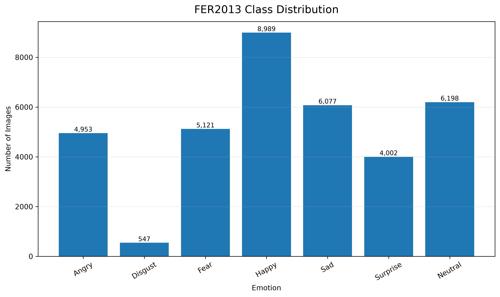

### Emotion Samples

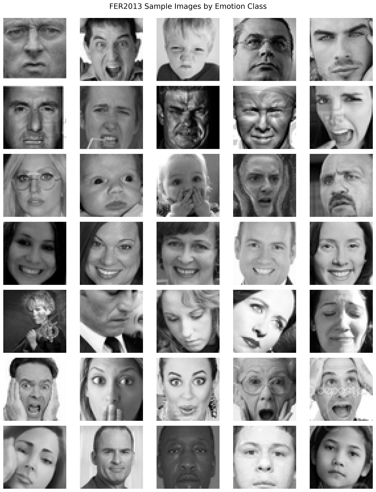

---

## 4. Preprocessing

Each FER2013 image is stored as a string of 2304 pixel values. The preprocessing pipeline converts each string into a normalized tensor.


### Preprocessing Steps

| Step | Purpose |
|---|---|
| Pixel parsing | Convert CSV string into numeric values |
| Shape validation | Ensure 48×48 structure |
| Range validation | Ensure pixel values are valid |
| Normalization | Scale pixels to `[0, 1]` |
| Channel expansion | Convert image to `(48, 48, 1)` |

For webcam or external images, optional histogram equalization is used to reduce lighting sensitivity.

---

## 5. Model Architectures

### 5.1 Baseline CNN

The baseline CNN is designed as a simple reference model.

Main architecture:

```text
Input 48x48x1
Conv2D 32 + ReLU
MaxPooling2D
Dropout

Conv2D 64 + ReLU
MaxPooling2D
Dropout

Conv2D 128 + ReLU
MaxPooling2D
Dropout

Flatten
Dense 128 + ReLU
Dropout
Dense 7 + Softmax
```

Parameter count:

```text
683,527
```

### 5.2 Improved CNN

The improved CNN is designed to improve generalization.

Main improvements:

- Data augmentation
- Batch normalization
- Deeper convolutional blocks
- Global average pooling
- Dropout regularization

Parameter count:

```text
617,511
```

The improved model is deeper than the baseline but has fewer parameters because it uses global average pooling instead of flattening.

---

## 6. Experiments

Three experiments were conducted.

| Experiment | Architecture | Class Weights | Purpose |
|---|---|---:|---|
| Baseline CNN | Simple CNN | No | Establish reference performance |
| Improved CNN + Class Weights | Improved CNN | Yes | Test imbalance compensation |
| Improved CNN No Class Weights | Improved CNN | No | Test architecture improvement alone |

---

## 7. Training Setup

| Parameter | Value |
|---|---:|
| Image size | 48×48 |
| Channels | 1 |
| Number of classes | 7 |
| Batch size | 64 |
| Epochs | 25 |
| Optimizer | Adam |
| Loss | Sparse categorical crossentropy |
| Main metric | Accuracy |

Callbacks used:

- Model checkpointing
- Early stopping
- ReduceLROnPlateau
- CSV logging

---

## 8. Results

### Model Comparison


| Model | Test Accuracy | Macro Precision | Macro Recall | Macro F1 | Weighted F1 | Test Loss |
|---|---:|---:|---:|---:|---:|---:|
| Baseline CNN | 0.5882 | 0.5912 | 0.5211 | 0.5304 | 0.5731 | 1.1067 |
| Improved CNN + Class Weights | 0.5252 | 0.4440 | 0.4896 | 0.4439 | 0.4948 | 1.2128 |
| Improved CNN No Class Weights | 0.5977 | 0.4855 | 0.5027 | 0.4870 | 0.5811 | 1.0636 |

### Best Model by Metric

| Metric | Best Model | Score |
|---|---|---:|
| Test Accuracy | Improved CNN No Class Weights | 0.5977 |
| Macro F1 | Baseline CNN | 0.5304 |
| Weighted F1 | Improved CNN No Class Weights | 0.5811 |

---

## 9. Baseline CNN Analysis

Baseline test results:

| Metric | Value |
|---|---:|
| Test Accuracy | 0.5882 |
| Macro Precision | 0.5912 |
| Macro Recall | 0.5211 |
| Macro F1 | 0.5304 |
| Weighted F1 | 0.5731 |
| Test Loss | 1.1067 |

Training curves:

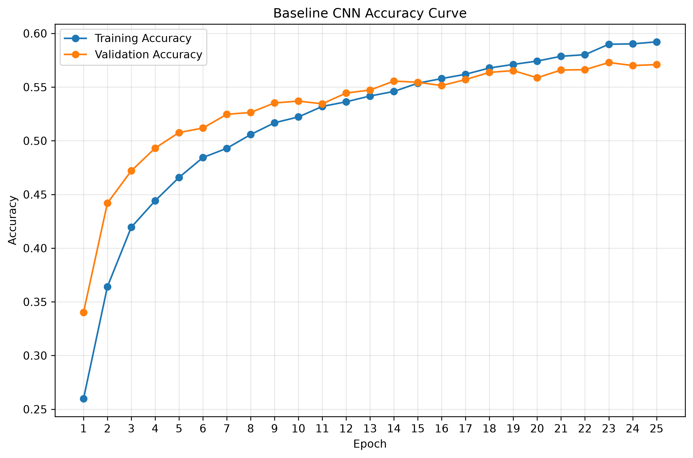

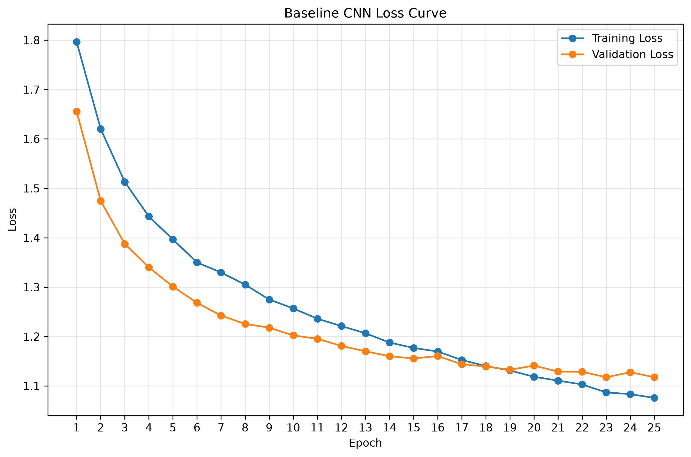

Confusion matrix:

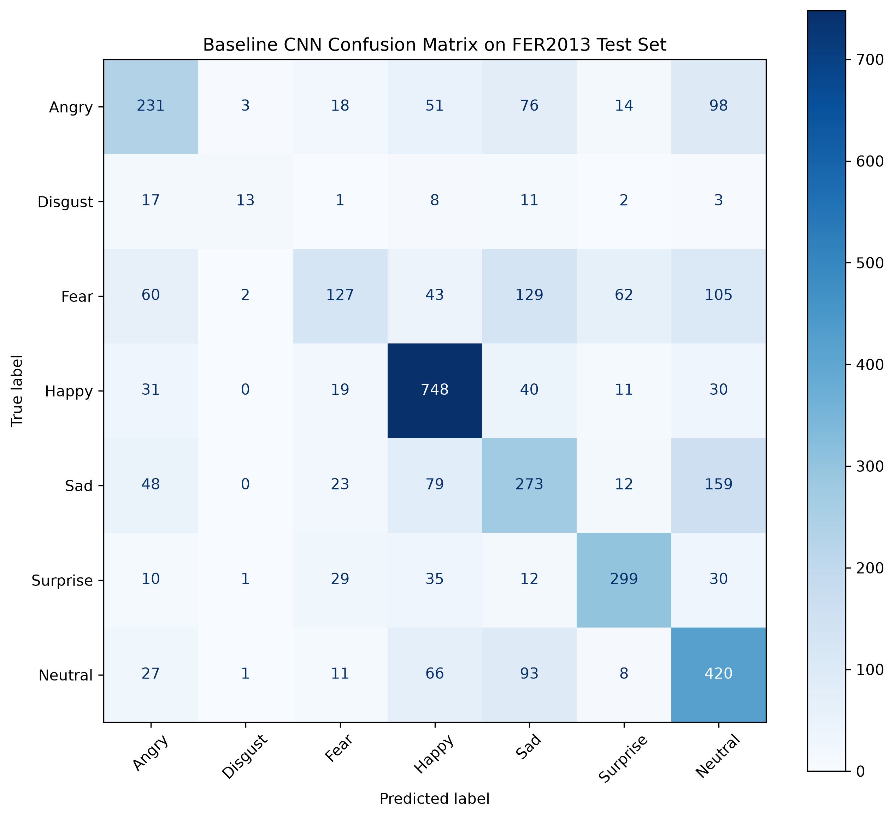

---

## 10. Improved CNN Analysis

### Improved CNN with Class Weights

| Metric | Value |
|---|---:|
| Test Accuracy | 0.5252 |
| Macro Precision | 0.4440 |
| Macro Recall | 0.4896 |
| Macro F1 | 0.4439 |
| Weighted F1 | 0.4948 |
| Test Loss | 1.2128 |

Training curves:

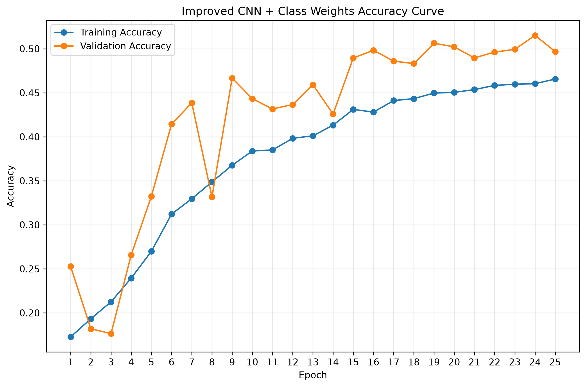

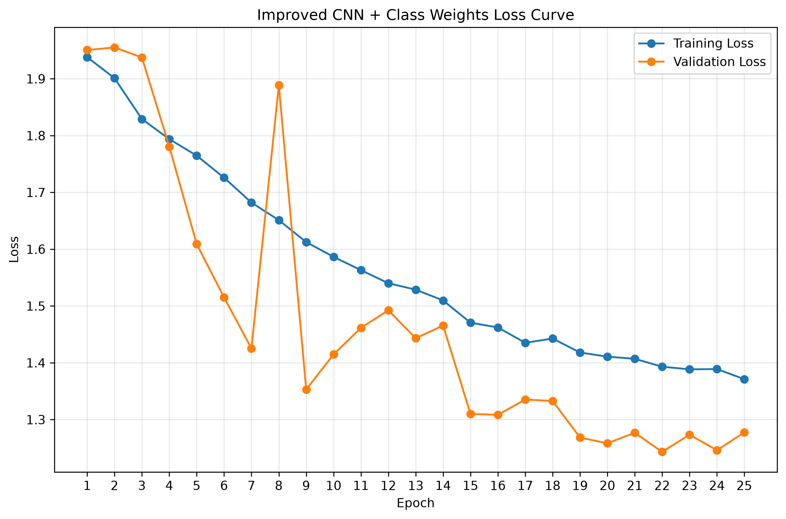

Confusion matrix:

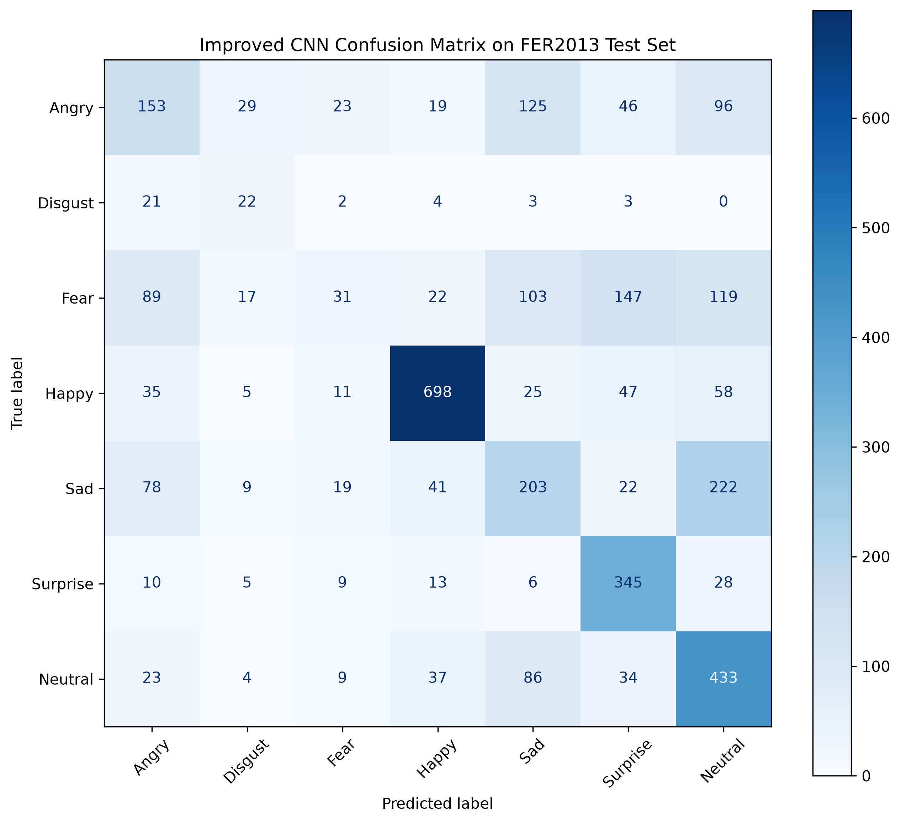

### Improved CNN without Class Weights

| Metric | Value |
|---|---:|
| Test Accuracy | 0.5977 |
| Macro Precision | 0.4855 |
| Macro Recall | 0.5027 |
| Macro F1 | 0.4870 |
| Weighted F1 | 0.5811 |
| Test Loss | 1.0636 |

Training curves:

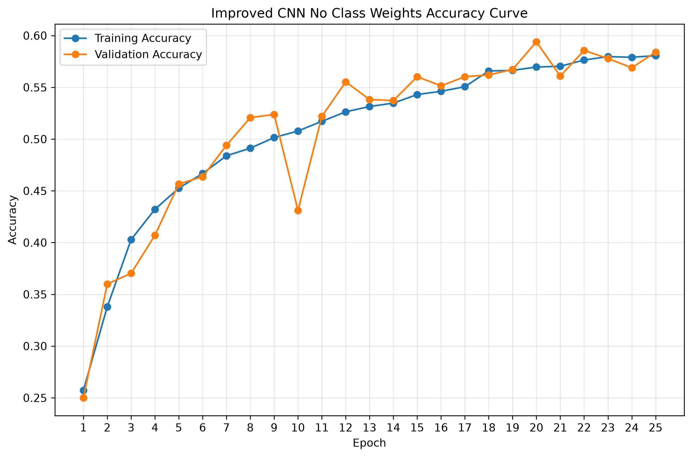

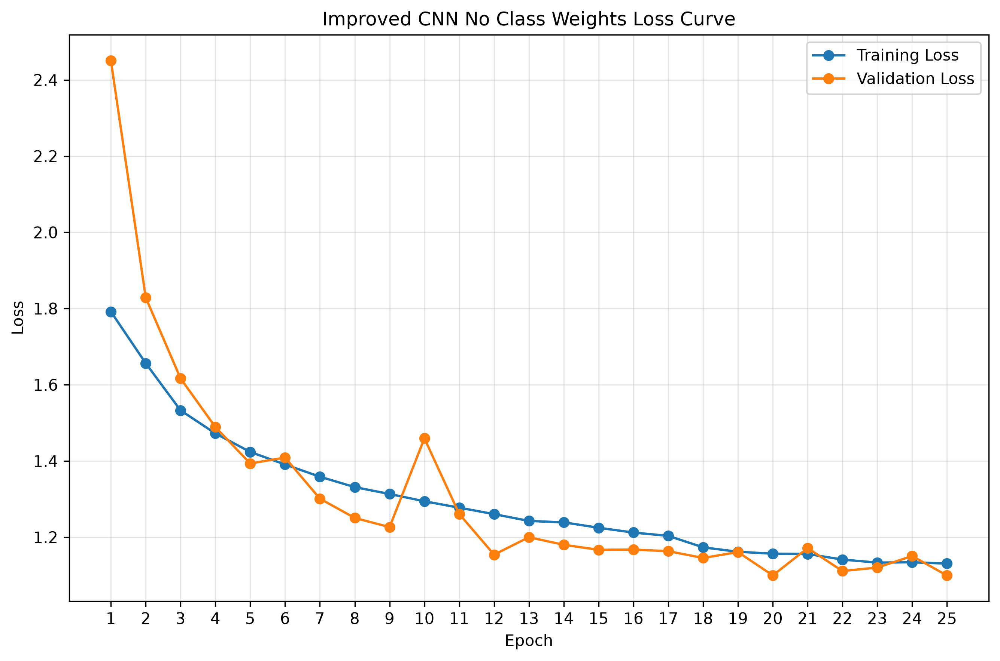

Confusion matrix:


---

## 11. Ablation Discussion

The ablation study produced an important finding:

- The improved architecture without class weights achieved the best overall accuracy.
- The baseline achieved the best macro F1-score.
- The class-weighted model improved attention to some minority-class behavior but reduced overall performance.

This shows that class weighting is not automatically beneficial. It must be evaluated carefully because it may distort the decision boundary.

---

## 12. Confidence Thresholding

The selected model outputs softmax probabilities. A threshold is applied to the maximum probability.

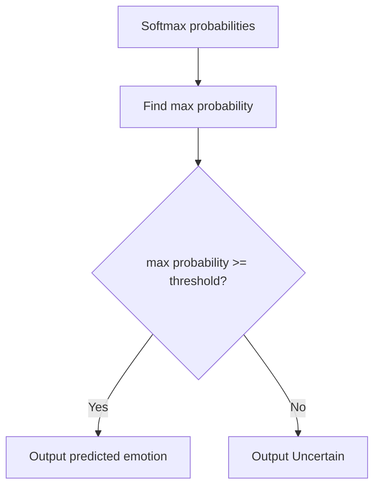

### Threshold Results


| Threshold | Coverage | Rejection Rate | Accepted Accuracy |
|---:|---:|---:|---:|
| 0.40 | 0.6793 | 0.3207 | 0.6944 |
| 0.45 | 0.5751 | 0.4249 | 0.7326 |
| 0.50 | 0.4971 | 0.5029 | 0.7702 |
| 0.55 | 0.4316 | 0.5684 | 0.8147 |
| 0.60 | 0.3784 | 0.6216 | 0.8476 |
| 0.65 | 0.3399 | 0.6601 | 0.8713 |
| 0.70 | 0.3031 | 0.6969 | 0.8906 |
| 0.75 | 0.2641 | 0.7359 | 0.9146 |
| 0.80 | 0.2299 | 0.7701 | 0.9333 |
| 0.85 | 0.1953 | 0.8047 | 0.9529 |
| 0.90 | 0.1599 | 0.8401 | 0.9704 |

### Recommended Threshold

```text
0.55
```

At threshold `0.55`:

| Metric | Value |
|---|---:|
| Raw Accuracy | 0.5940 |
| Accepted Accuracy | 0.8147 |
| Coverage | 0.4316 |
| Rejection Rate | 0.5684 |

This is a practical compromise between reliability and usability.

---

## 13. Test Prediction Demo


The demo figure shows:

- True label
- Predicted label
- Confidence
- Rejection status
- Top-3 predictions

---

## 14. Real-Time Webcam System

The real-time pipeline is:

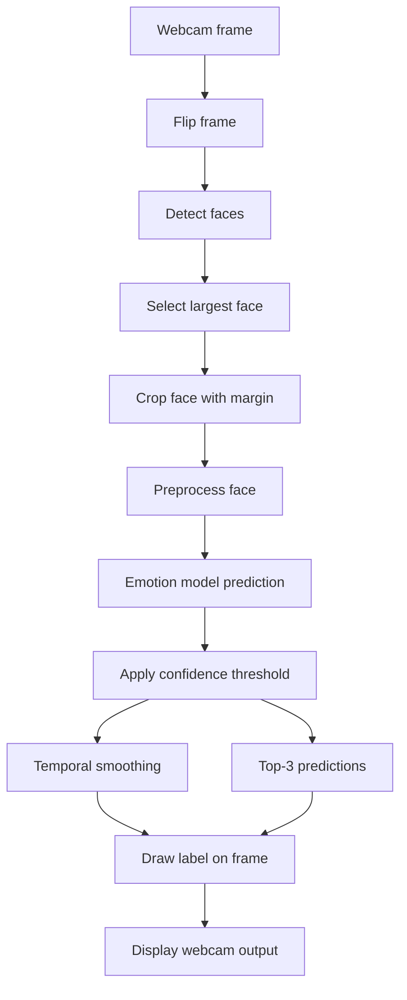

The webcam demo supports:

| Feature | Description |
|---|---|
| Face detection | OpenCV Haar Cascade |
| Face selection | Largest detected face |
| Threshold | 0.55 |
| Smoothing window | 7 frames |
| Snapshot key | `s` |
| Exit keys | `q` or `ESC` |

---

## 15. Testing

The project includes automated tests for core logic.

Current result:

```text
56 passed
```

| Test File | Purpose |
|---|---|
| `test_preprocessing.py` | Image preprocessing |
| `test_processed_loader.py` | Processed dataset loading |
| `test_models.py` | Model architecture validation |
| `test_thresholding.py` | Confidence thresholding |
| `test_inference.py` | Inference pipeline |
| `test_face_detection.py` | Face detection helpers |
| `test_temporal_smoothing.py` | Temporal smoothing |

---

## 16. Limitations

| Limitation | Effect |
|---|---|
| Low image resolution | Facial details may be lost |
| Class imbalance | Minority classes perform worse |
| Ambiguous labels | Some emotions are visually similar |
| Haar Cascade detector | May fail under difficult lighting or pose |
| Threshold rejection | Improves reliability but reduces coverage |
| No transfer learning | Limits model strength |

---

## 17. Future Work

Recommended improvements:

1. Transfer learning with pretrained CNNs.
2. Stronger face detection with MediaPipe, RetinaFace, or YuNet.
3. Face alignment.
4. Focal loss.
5. Oversampling for minority classes.
6. Confidence calibration.
7. Multi-face tracking.
8. Web or desktop interface.
9. Model export for deployment.

---

## 18. Conclusion

The final selected model is the **Improved CNN without class weights**.

The final threshold is **0.55**.

The project demonstrates a complete machine learning workflow and adds a practical reliability mechanism through confidence-aware rejection. This makes the final system more suitable for real-time demonstration than a model that always forces a prediction.
